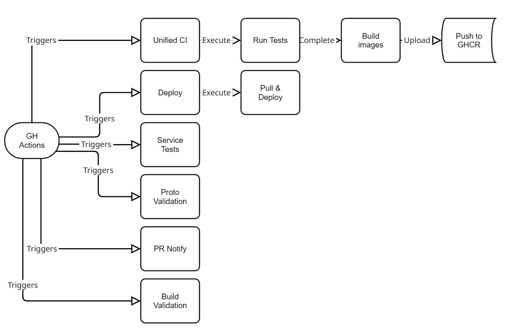

<!-- 
_class: lead
_footer: '<h1 style="font-size: 1.17em; color: #0D2447;">Kirill Efimovich, Aleliya Turushkina, Mikhail Trifonov, Nikita Maksimenko, Timur Salakhov, Ravil Kazeev, Kirill Shumskiy</h1>' 
-->

<h1>Open Labs Share</h1>
<h2>Next-Gen Learning Platform: Microservices Meets Education</h2>

---

<!-- _class: compact-list -->

## ⚡ The Problem & Our Vision

**Current challenges in tech education:**

- 📚 **Fragmented Learning Resources**
- 🔄 **Weak Industry-Education Bridge**

**Our solution - Open Labs Share:**

> Peer-to-peer knowledge sharing platform, with comprehensive feedback system and interactive learning experience through labs and articles with AI-powered autograding.

---

<!-- _class: compact-list -->

## 🔰 Meet the team

- 🌁 **Kirill Efimovich (PM/DevOps)** - *Project Leadership & DevOps Engineer*
- 🔒 **Mikhail Trifonov** - *Backend Engineer*
- 🏗️ **Nikita Maksimenko** - *Backend Engineer*
- 📚 **Timur Salakhov** - *Backend Engineer* 
- 💌 **Ravil Kazeev** - *Backend Engineer*
- 🤖 **Kirill Shumskiy** - *ML & Backend Engineer*
- 🎨 **Aleliya Turushkina** - *Designer & Frontend Engineer*

---

<!-- _class: compact-list -->

## Live Technical Demo: 

**Live Demo Links:**
- 🎥 **Main Demo:** [Google Drive](https://drive.google.com/file/d/1xfI16HWrH7RtiNjHh0qmo8WQh7ozDTo0/view?usp=sharing)
- 🎬 **Alternative:** [Yandex Disk](https://disk.yandex.ru/i/ylEaXv8_URGLbg)

---

<h2 class="service-header">🌸 Frontend: Tech Stack & Connections</h2>

- :sunny: **Frontend:** React, Vite, Tailwind CSS, React Router
- :seedling: **Component Libraries:** React PDF Viewer, Markdown/KaTeX
- :earth_africa: **API Integration:**
    - Communicates with backend via REST API through the API Gateway
    - Auth, Labs, Articles, Submissions, Feedback, and ML services
    - Real-time and file download support from MinIO

---

---

<h2 class="service-header">🔐 Authentication & Users Service 👥</h2>

Mikhail Trifonov (Backend Engineer)

  

    

      <h3 class="service-title">🔐 Authentication Service</h3>
      

        <strong>Handles all authentication flows and token lifecycle management for secure access control</strong> 🔑
      

    

    

      <h3 class="service-title">👫Users Service</h3>
      

        <strong>Manages all user data, credentials, and points for solving & reviewing labs</strong> 💸
      

    

    

      <h4 class="service-title">☕ Tech Stack:</h4>
      
Java 21 + Spring Boot 3.5, Spring Security + JWT, Flyway

    

  

  
  

    
  

---

<h2 class="service-header">📥 API Gateway 📤</h2>

---

<h2 class="service-header">API Gateway: Primary Use Case</h2>

**Centralized entry point and request orchestration for all client interactions** 🌐

- 🌐 **Centralized Entry Point:** Serves as the unified access layer for all client REST API requests
- 🔀 **Request Routing:** Directs incoming requests to the appropriate microservice (`auth`, `user`, `article`, `lab`) via gRPC
- 🔒 **Authentication & Security:** Validates JWT tokens and user's permissions
- 📝 **Cross-Cutting Concerns:** Handles logging, request tracing, and error handling for all API traffic
- 🧠 **Business Logic Execution:** Aggregating data and enforcing business rules beyond simple routing

---

<h2 class="service-header">API Gateway: Tech Stack & Connections</h2>

**Java Spring Boot with REST-to-gRPC translation** ☕🔄

- 🧑‍💻 **Java 21 + Spring Framework:** 
    ⤷ REST API, gRPC, Jackson Validators, Spring AOP
- 📥 **REST API:**
    ⤷ REST is the simplest and most widely supported method for web communication
- 🛡️ **Security Layer:**
    ⤷ Intercept incoming REST requests for authentication and authorization
- 🔀 **gRPC Client:** 
    ⤷ gRPC provides high-speed, type-safe, and scalable service-to-service communication

---

<h2 class="service-header">📚 Articles Service</h2>

---

<h2 class="service-header">Articles Service: Primary Use Case</h2>

**Manages all articles & assets metadata** 🗄️

- 📝 **Articles Operations:** Provides CRUD for articles details
- 🗂️ **Content Management:** Handles articles assets in independent storage system
- ⚙️ **Metadata Management:** Organizes and updates metadata for articles and its assets
- 🔍 **Searching:** Provides articles searching based on its title and abstract

---

<h2 class="service-header">Articles Service: Tech Stack & Connections</h2>

**Python-based microservice with PostgreSQL and MinIO storage** 🐍

- 🐍 **Programming Language:** Python 3.12
- 🔄 **Inter-service Communication:** gRPC

**Service Integrations:**
- 🚪 **API Gateway:** Receive and return data in gRPC format
- 🗄️ **PostgreSQL Database:** Store all articles and its assets metadata
- ☁️ **MinIO Storage System:** Store all articles assets

---

<h2 class="service-header">📚 Labs Service</h2>

---

<h2 class="service-header">Labs Service: Primary Use Case</h2>

**Manages all labs, submissions & educational content** 🗄️

- 📚 **Labs Operations:** Provides CRUD for lab assignments with tags
- 📤 **Submissions Management:** Handles submissions with text content and file assets
- 🏷️ **Tag System:** Organizes labs with flexible tagging and search capabilities
- 📊 **Grading System:** Tracks submission status and grade workflow

---

<h2 class="service-header">Labs Service: Tech Stack & Connections</h2>

**Python with hybrid database architecture and MinIO storage** 🐍

- 🐍 **Programming Language:** Python 3.12
- 🔄 **Inter-service Communication:** gRPC

**Service Integrations:**
- 🚪 **API Gateway:** Single entry point for all requests
- 🗄️ **PostgreSQL Database:** Store labs, submissions, tags, and assets metadata
- 📄 **MongoDB Database:** Store submission text content for flexible storage
- ☁️ **MinIO Storage System:** Store lab and submission assets in organized buckets

---

<h2 class="service-header">💬 Feedback Service</h2>

---

<h2 class="service-header">Feedback Service: Primary Use Case</h2>

**Comprehensive feedback and discussion management system** 💬

- 📝 **Comprehensive Feedback System:** Enables reviewers to create, update, and delete detailed feedback on submissions using Markdown for text and code formatting
- 💬 **Organized Discussion Section:** Powers a threaded commenting system for both labs and articles. Nested replies keep conversations structured and easy to follow
- 📎 **Attachment Handling:** Allows multiple file attachments per feedback entry, using efficient gRPC streaming to handle large uploads and downloads without high memory usage

---

<h2 class="service-header">Feedback Service: Tech Stack & Connections</h2>

**Go with a multi-storage backend and gRPC API** 🐹💾

- 🐹 **Go 1.24:**
&nbsp;&nbsp;&nbsp;⤷ High-performance, concurrent service ideal for I/O-heavy tasks
- 🗣️ **gRPC Server:**
&nbsp;&nbsp;&nbsp;⤷ Provides a typed API for feedback, comments, and file streaming
- 🗄️ **Multi-Storage Backend:**
&nbsp;&nbsp;&nbsp;⤷ **PostgreSQL:** Stores structured feedback metadata
&nbsp;&nbsp;&nbsp;⤷ **MongoDB:** Stores unstructured comments and feedback content
&nbsp;&nbsp;&nbsp;⤷ **MinIO:** Object storage for all file attachments

---

<h2 class="service-header">📓 Marimo Service</h2>

---

<h2 class="service-header">Marimo Service: Primary Use Case</h2>

- 👟 **Code Execution:** Real-time cell execution with output capture and error handling 🖐️
- 📊 **Asset Management:** Upload/download datasets and files for notebook use 🐪
- 🎛️ **Interactive Widgets:** Set of basic Marimo input widgets which value can be used in code (sliders, switchers, text fields, etc.) 📟
- 📁 **Cross-cells state memory:** Variables and modules from executed cells are available in other cells 📦

---

<h2 class="service-header">Marimo Service: Tech Stack & Connections</h2>

- 🔧 **Java Manager + Python Executor:** 
&nbsp;&nbsp;&nbsp;⤷ Java handles `REST API` and `metadata` while Python `executes` notebooks
- 🗄️ **PostgreSQL:** 
&nbsp;&nbsp;&nbsp;⤷ Tracks notebook metadata, user sessions, and execution trails with TTL cleanup
- 📦 **MinIO:**
&nbsp;&nbsp;&nbsp;⤷ Object storage for notebook `files` and user-uploaded `assets`
- 🔗 **gRPC:**  
&nbsp;&nbsp;&nbsp;⤷ Java Manager ← `execute requests, session management` → Python Executor
- 🐍 **Marimo:** Interactive notebook execution with widgets
&nbsp;&nbsp;&nbsp;⤷ Interactive notebook execution with ✨`widgets`✨

---

<h2 class="service-header">ML Service: Primary Use Case</h2>

**Two powerful AI enhancements for the learning platform** 🧠

- 🔍 **AI RAG Assistant:** Context-aware code and documentation helper, leveraging Retrieval-Augmented Generation (RAG) to deliver accurate, real-time support to students
- ✅ **Autograding:** Automated code assessment system for evaluating submissions instantly — ideal for learning platforms

---

<!-- _class: compact-list -->

<h2 class="service-header">ML Service: Tech Stack & Connections</h2>

**FastAPI backend with specialized AI models and infrastructure** 🐍🤖

<h4>🤖 AI RAG Assistant</h4>
<ul>
  <li>Qwen2.5-Coder-1.5B-Instruct (local inference)</li>
  <li>Qdrant vector store</li>
  <li>BAAI/bge-small-en-v1.5 embeddings</li>
</ul>

<h4>✅ Autograding</h4>
<ul>
  <li>deepseek-r1-distill-llama-70b (groq inference)</li>
  <li>Menagerie dataset: Graded CS1 Assignments for evaluation</li>
</ul>

**Core Architecture:**
🐍 **FastAPI-based backend** with three-layer structure 
🥬 **Celery** for asynchronous tasks
🛢️ **Redis** for caching and message broker

---

<h2 class="service-header">🤖 ML Service Architecture</h2>

---

<h2 class="service-header">🏙️ DevOps & Infrastructure</h2>

---

<h2 class="service-header">🏛️ DevOps: Primary Use Case</h2>

**Key GitHub Actions Workflows:** 💫
- 🔧 **Compilation Validation:** Ensures all services compile
- 🏏 **Test Execution:** Runs unit & integration tests
- 🐳 **Docker Build Validation:** Buillds, validates and pushes images to GHCR
- ✈️ **Deployment Automation:** Handles the Blue-Green deployment logic
- 🔗 **Team help tools:** to automate issues managing and PR notifiers to keep the team perfectly synchronized

---

<h2 class="service-header">🛤️ DevOps: Infrastructure</h2>

<h3>🔵 Green-Blue Strategy 🟢</h3>
<ul>
    <li><b> 0️⃣ Zero Downtime:</b> Updates are seamless</li>
    <li><b>🎞️ Workflow:</b>
        <ol type="i">
            <li>Deploy new version (Green) alongside Production (Blue)</li>
            <li>Test Green environment internally</li>
            <li>Switch HAProxy to route traffic to Green</li>
            <li>Keep Blue for instant rollback</li>
        </ol>
    </li>
</ul>

<h3>🐧 Server & Networking</h3>
<ul>
  <li><b>Host:</b> Self-managed server on Ubuntu 24.04</li>
  <li><b>Specs:</b> 6-Core CPU, 16GB RAM, 240GB SSD</li>
  <li><b>Proxy:</b> NGINX & HAProxy</li>
  <li><b>Access:</b> CloudPub for public NAT traversal</li>
  <li><b>Monitoring:</b> cAdvisor for container metrics</li>
</ul>

---

<h2 class="service-header">📺 Communication Problems</h2>

| ❌ **Problems** | ✅ **Solutions** |
|---|---|
| ❌ Problems in task setting and communication between people | ✅ Create clear GitHub rules for issue creation, assignment workflows, and collaborative development processes |
| ❌ Too many services that use the same data model | ✅ Create scripts that automatically check data model consistency across all services |

---

<h2 class="service-header">🏭 Implementation Problems</h2>

| ❌ **Problems** | ✅ **Solutions** |
|---|---|
| ❌ A single database was inefficient for managing varied data types. | ✅ Used the best database for each job: PostgreSQL for metadata, MongoDB for comments, and MinIO for file attachments. |
| ❌ University network NAT blocked access to self-hosted server. | ✅ After issues with Cloudflare, we successfully used **CloudPub** to create a secure tunnel for public access. |

---

<h2 class="service-header">🏃🏻 Try it out!</h2>

---

<!-- _class: lead -->

<h1>Thank you!</h1>
<h4 style="text-align: center; font-size: 1.2em; color: #0D2447;">We're glad to hear your questions! 🛒🤗🎸</h4>
