<!-- 
_class: lead
_footer: 'Practicum project, S25: Aleliya Turushkina, Kirill Efimovich, Nikita Maksimenko, Timur Salakhov, Ravil Kazeev, Mikhail Trifonov, Kirill Shumskiy' 
-->

# 🚀 Open Labs Share

**A Microservices-Driven Learning Platform**

---

## Agenda

- **Problem & Solution Overview**
- **System Architecture**
- **Authentication Service** (4 slides)
- **Users Service** (4 slides)
- **Labs Service** (4 slides)
- **Feedback Service** (4 slides)
- **ML Service** (3 slides)
- **Frontend Architecture** (3 slides)
- **DevOps & Infrastructure** (5 slides)
- **Demo & Discussion**

---

## The Problem: Skills Gap in Tech Education

**Current challenges in technical education:**

- **Academic curricula** focus on theory while industry needs practical, deployable skills
- **Skill verification** relies on grades rather than real-world project portfolios
- **Mentorship bottleneck** - limited access to experienced developers for guidance
- **Knowledge transfer** inefficiencies between experts and learners

**The technical challenge:** Build a scalable platform that connects experts with learners through practical, hands-on projects while handling real-world engineering complexities.

---

## Our Technical Solution: Bridging the Gap

**Open Labs Share** - A distributed, microservices-based learning platform with integrated peer review and AI assistance.

**We engineer the solution through:**
- **Expert workflow management** - Tools for creating, versioning, and distributing lab content
- **Learner development pipeline** - Submission handling, automated processing, and feedback aggregation
- **Community-driven quality assurance** - Distributed peer review system with reputation tracking

---

<!-- _class: tech-details -->

## System Architecture Overview

**Microservices architecture built for scale and maintainability**

```mermaid
graph TD;
    subgraph Client Layer
        Frontend[🌐 React + Vite<br/>TypeScript SPA];
    end

    subgraph API Layer
        Gateway[🚪 Go API Gateway<br/>Rate Limiting & Auth];
    end

    subgraph Business Logic
        Auth[🔐 Auth Service<br/>JWT & RBAC];
        Users[👥 Users Service<br/>Profile Management];
        Labs[🧪 Labs Service<br/>Content & Submissions];
        Feedback[💬 Feedback Service<br/>Peer Reviews];
        ML[🤖 ML Service<br/>AI Assistant];
    end

    subgraph Data Layer
        UserDB[🐘 Users DB<br/>PostgreSQL];
        LabsDB[🐘 Labs DB<br/>PostgreSQL];
        FeedbackDB[🐘 Feedback DB<br/>PostgreSQL];
        MLDB[🐘 ML DB<br/>PostgreSQL];
        Storage[📦 MinIO<br/>Object Storage];
    end

    Frontend --> Gateway;
    Gateway --> Auth;
    Gateway --> Users;
    Gateway --> Labs;
    Gateway --> Feedback;
    Gateway --> ML;

    Auth --> UserDB;
    Users --> UserDB;
    Labs --> LabsDB;
    Labs --> Storage;
    Feedback --> FeedbackDB;
    ML --> MLDB;
```



---

# 🔐 Authentication Service Overview

**Mikhail Trifonov - Security Engineer**

**Core Responsibilities:**
- **User Authentication & Authorization** - JWT-based auth with role management
- **Session Management** - Secure token lifecycle and refresh mechanisms
- **Security Layer** - Rate limiting, brute force protection, audit logging
- **Integration Point** - Central auth for all microservices

**Technology Stack:**
- **Java Spring Boot** with Spring Security framework
- **PostgreSQL** for user credentials and session storage
- **JWT** tokens with RS256 signing
- **RESTful API** design for auth endpoints

---

## Auth Service: Security Architecture

**Mikhail Trifonov**

**Security Implementation:**
```
┌─────────────────┐    ┌──────────────────┐    ┌─────────────────┐
│   Client        │    │   Auth Service   │    │   Database      │
│                 │    │                  │    │                 │
│ Login Request   │───▶│ Password Hash    │───▶│ User Validation │
│                 │    │ + Salt Check     │    │                 │
│ JWT Token       │◄───│ JWT Generation   │◄───│ Role Assignment │
└─────────────────┘    └──────────────────┘    └─────────────────┘
```

**Key Features:**
- **bcrypt** password hashing with salt rounds
- **JWT tokens** with 1-hour expiration
- **Refresh tokens** for seamless re-authentication
- **Role-based access control** (LEARNER, EXPERT, ADMIN)

---

## Auth Service: API Design & Endpoints

**Mikhail Trifonov**

**Core REST Endpoints:**
- `POST /auth/register` - User registration with email verification
- `POST /auth/login` - Authentication with JWT token response
- `POST /auth/refresh` - Token refresh mechanism
- `POST /auth/logout` - Token invalidation
- `GET /auth/verify` - Token validation for other services

**Request/Response Example:**
```json
// Login Request
{
  "email": "user@example.com",
  "password": "securePassword"
}

// Response
{
  "accessToken": "eyJhbGciOiJSUzI1NiIs...",
  "refreshToken": "dGhpcyBpcyBhIHNhbXBsZQ...",
  "tokenType": "Bearer",
  "expiresIn": 3600
}
```

---

## Auth Service: Performance & Monitoring

**Mikhail Trifonov**

**Performance Metrics:**
- **Authentication latency:** < 200ms for login requests
- **Token validation:** < 50ms for JWT verification
- **Database queries:** Optimized with connection pooling
- **Concurrent users:** Supports 1000+ simultaneous authentications

**Security Monitoring:**
- **Failed login attempts** tracking and alerting
- **Suspicious activity** detection (multiple IPs, rapid requests)
- **Token usage analytics** for security audit trails
- **Database encryption** at rest and in transit

**High Availability:**
- **Stateless design** for horizontal scaling
- **Database replication** for failover
- **Health checks** integrated with API Gateway

---

# 👥 Users Service Overview

**Nikita Maksimenko - Backend Architect**

**Core Responsibilities:**
- **User Profile Management** - Complete user data lifecycle
- **Role & Permission System** - Fine-grained access control
- **User Discovery** - Search and recommendation algorithms
- **Data Integration** - Central user data for all services

**Technology Stack:**
- **Java Spring Boot** with gRPC communication
- **PostgreSQL** with optimized indexing
- **Protocol Buffers** for type-safe service communication
- **Redis caching** for performance optimization

---

## Users Service: Data Architecture

**Nikita Maksimenko**

**Database Schema Design:**
```sql
-- Core user profile table
users (
  id BIGSERIAL PRIMARY KEY,
  email VARCHAR(255) UNIQUE NOT NULL,
  username VARCHAR(50) UNIQUE NOT NULL,
  full_name VARCHAR(200),
  role user_role_enum NOT NULL,
  created_at TIMESTAMP DEFAULT NOW(),
  updated_at TIMESTAMP DEFAULT NOW()
);

-- User skills and expertise
user_skills (
  user_id BIGINT REFERENCES users(id),
  skill_name VARCHAR(100),
  proficiency_level INTEGER CHECK (proficiency_level BETWEEN 1 AND 5),
  verified BOOLEAN DEFAULT FALSE
);
```

**Performance Optimizations:**
- **Composite indexes** on frequently queried fields
- **Partial indexes** for active users only
- **Connection pooling** with HikariCP

---

## Users Service: gRPC Implementation

**Nikita Maksimenko**

**Protocol Buffer Definitions:**
```protobuf
service UserService {
  rpc GetUser(GetUserRequest) returns (UserResponse);
  rpc UpdateUser(UpdateUserRequest) returns (UserResponse);
  rpc SearchUsers(SearchUsersRequest) returns (SearchUsersResponse);
  rpc GetUsersByRole(GetUsersByRoleRequest) returns (UsersListResponse);
}

message UserResponse {
  int64 id = 1;
  string email = 2;
  string username = 3;
  string fullName = 4;
  UserRole role = 5;
  repeated UserSkill skills = 6;
}
```

**Service Communication:**
- **Type-safe contracts** generated from protobuf
- **Streaming support** for bulk operations
- **Error handling** with gRPC status codes
- **Load balancing** with round-robin

---

## Users Service: Business Logic & Integration

**Nikita Maksimenko**

**Core Business Operations:**
- **User Registration Flow** - Profile creation with validation
- **Skill Management** - Adding, updating, and verifying expertise
- **Role Assignment** - Dynamic role changes with permission updates
- **User Analytics** - Activity tracking and engagement metrics

**Integration Patterns:**
- **Event-driven updates** to other services via message queue
- **Caching strategy** for frequently accessed user data
- **Circuit breaker** pattern for external service calls
- **Distributed tracing** for debugging across services

**Performance Results:**
- **Sub-millisecond** gRPC calls for user lookups
- **99.9% uptime** with health monitoring
- **Horizontal scaling** tested up to 10 service instances

---

# 🧪 Labs Service Overview

**Timur Salakhov - Content Systems Engineer**

**Core Responsibilities:**
- **Lab Content Management** - Creation, versioning, and distribution
- **File Processing Pipeline** - Async handling of uploads and submissions
- **Content Storage** - Integration with MinIO object storage
- **Submission Workflow** - End-to-end learner submission handling

**Technology Stack:**
- **Java Spring Boot** with async processing capabilities
- **MinIO** distributed object storage (S3-compatible)
- **PostgreSQL** for metadata and relational data
- **Apache Kafka** for event-driven processing
- **gRPC** for service communication

---

## Labs Service: Content Architecture

**Timur Salakhov**

**Content Management System:**
```
┌──────────────┐    ┌──────────────────┐    ┌─────────────────┐
│   Expert     │    │   Labs Service   │    │   MinIO         │
│   Creates    │───▶│   Content        │───▶│   Processing     │
│   Lab        │    │   Processing     │    │   Buckets       │
└──────────────┘    └──────────────────┘    └─────────────────┘
                           │
                           ▼
                    ┌──────────────────┐
                    │   PostgreSQL     │
                    │   Metadata DB    │
                    └──────────────────┘
```

**Content Types Supported:**
- **Markdown files** for lab instructions
- **Code templates** and starter files
- **Media assets** (images, videos)
- **Test files** for automated validation
- **Solution files** (instructor-only access)

---

## Labs Service: File Processing Pipeline

**Timur Salakhov**

**Asynchronous Processing Flow:**
```
Upload Request → Validation → Virus Scan → Compression → 
Storage → Metadata Update → Event Notification
```

**Key Components:**
- **File Validation** - Type checking, size limits, format verification
- **Security Scanning** - Malware detection before storage
- **Automatic Compression** - Optimize storage costs
- **Thumbnail Generation** - For image and video previews
- **CDN Distribution** - Global content delivery optimization

**Processing Performance:**
- **Parallel processing** of multiple files
- **Queue-based system** prevents overload
- **Real-time progress** tracking for users
- **Automatic retry** mechanism for failed uploads

---

## Labs Service: Submission Management

**Timur Salakhov**

**Submission Workflow:**


**Submission Features:**
- **Version control** for iterative submissions
- **Plagiarism detection** integration
- **Automatic format conversion** (PDF, DOCX → uniform format)
- **Submission deadlines** with timezone handling
- **Bulk download** for instructors

**Storage Optimization:**
- **Deduplication** of identical submissions
- **Tiered storage** (hot/warm/cold) based on access patterns
- **Backup replication** across multiple regions

---

## Labs Service: API Design & Performance

**Timur Salakhov**

**gRPC Service Definition:**
```protobuf
service LabsService {
  rpc CreateLab(CreateLabRequest) returns (LabResponse);
  rpc GetLab(GetLabRequest) returns (LabResponse);
  rpc SubmitAssignment(SubmitAssignmentRequest) returns (SubmissionResponse);
  rpc GetSubmissions(GetSubmissionsRequest) returns (SubmissionsListResponse);
  rpc UploadFile(stream FileChunk) returns (FileUploadResponse);
}
```

**Performance Metrics:**
- **File upload speed:** 50MB/s average throughput
- **Processing latency:** < 5 seconds for typical submissions
- **Storage efficiency:** 40% compression ratio achieved
- **Concurrent uploads:** 100+ simultaneous file transfers

**Monitoring & Alerts:**
- **Storage utilization** tracking
- **Processing queue** depth monitoring
- **Failed upload** rate alerting
- **Performance degradation** detection

---

# 💬 Feedback Service Overview

**Ravil Kazeev - Algorithms Engineer**

**Core Responsibilities:**
- **Peer Review Engine** - Intelligent matching of reviewers to submissions
- **Scoring Algorithms** - Fair and consistent evaluation systems
- **Quality Assurance** - Anti-spam and bias detection mechanisms
- **Analytics Engine** - Learning insights and progress tracking

**Technology Stack:**
- **Java Spring Boot** with algorithmic optimization
- **PostgreSQL** with advanced analytics queries
- **Redis** for real-time caching and session data
- **Apache Spark** for large-scale data processing
- **gRPC** for high-performance service communication

---

## Feedback Service: Review Matching Algorithm

**Ravil Kazeev**

**Intelligent Reviewer Assignment:**
```python
def match_reviewers(submission, available_reviewers):
    scores = []
    for reviewer in available_reviewers:
        skill_match = calculate_skill_overlap(submission.skills, reviewer.expertise)
        workload_factor = get_current_workload(reviewer.id)
        quality_score = get_historical_quality(reviewer.id)
        
        composite_score = (skill_match * 0.5) + 
                         (workload_factor * 0.3) + 
                         (quality_score * 0.2)
        scores.append((reviewer, composite_score))
    
    return select_top_reviewers(scores, count=3)
```

**Algorithm Features:**
- **Skill-based matching** using vector similarity
- **Workload balancing** to prevent reviewer burnout
- **Quality tracking** with feedback loop learning
- **Conflict of interest** detection and avoidance

---

## Feedback Service: Scoring & Quality Systems

**Ravil Kazeev**

**Multi-dimensional Scoring:**
```
┌─────────────────┐    ┌──────────────────┐    ┌─────────────────┐
│   Technical     │    │   Communication  │    │   Creativity    │
│   Accuracy      │    │   Clarity        │    │   Innovation    │
│   (0-100)       │    │   (0-100)        │    │   (0-100)       │
└─────────────────┘    └──────────────────┘    └─────────────────┘
         │                       │                       │
         └───────────────────────┼───────────────────────┘
                                 ▼
                         ┌──────────────────┐
                         │  Weighted Final  │
                         │     Score        │
                         │   (0-100)        │
                         └──────────────────┘
```

**Quality Assurance Features:**
- **Cross-validation** between multiple reviewers
- **Outlier detection** for inconsistent scores
- **Bias correction** algorithms
- **Appeal process** for disputed reviews

---

## Feedback Service: Anti-Spam & Analytics

**Ravil Kazeev**

**Spam Detection Pipeline:**
- **Content analysis** for generic/template responses
- **Timing analysis** for suspiciously fast reviews
- **Pattern recognition** for duplicate feedback
- **Machine learning** classification for quality prediction

**Real-time Analytics:**
```sql
-- Performance tracking queries
SELECT 
    reviewer_id,
    AVG(review_quality_score) as avg_quality,
    COUNT(*) as total_reviews,
    AVG(time_to_review) as avg_response_time
FROM feedback_analytics 
WHERE created_at >= NOW() - INTERVAL '30 days'
GROUP BY reviewer_id
ORDER BY avg_quality DESC;
```

**Dashboard Metrics:**
- **Review completion rates** by user segments
- **Quality trends** over time
- **Response time** distributions
- **User satisfaction** scores

---

## Feedback Service: Data Engineering & Performance

**Ravil Kazeev**

**Database Optimization:**
```sql
-- Optimized feedback storage
CREATE TABLE feedback_entries (
    id BIGSERIAL PRIMARY KEY,
    submission_id BIGINT NOT NULL,
    reviewer_id BIGINT NOT NULL,
    technical_score INTEGER CHECK (technical_score BETWEEN 0 AND 100),
    communication_score INTEGER CHECK (communication_score BETWEEN 0 AND 100),
    creativity_score INTEGER CHECK (creativity_score BETWEEN 0 AND 100),
    comments TEXT,
    created_at TIMESTAMP DEFAULT NOW(),
    
    -- Performance indexes
    INDEX idx_submission_reviews (submission_id, created_at),
    INDEX idx_reviewer_performance (reviewer_id, created_at)
);
```

**Performance Results:**
- **Sub-second query times** for complex analytics
- **99.5% algorithm accuracy** in reviewer matching
- **75% reduction** in review bias through algorithmic correction
- **Real-time processing** of 1000+ concurrent reviews

---

# 🤖 ML Service Overview

**Kirill Shumskiy - ML Engineer**

**Core Responsibilities:**
- **AI-Powered Assistance** - Context-aware help for learners
- **Content Recommendations** - Personalized lab suggestions
- **Quality Assessment** - Automated submission evaluation
- **Predictive Analytics** - Learning outcome predictions

**Technology Stack:**
- **Python FastAPI** for high-performance ML serving
- **Transformers** for natural language processing
- **scikit-learn** for recommendation algorithms
- **PostgreSQL** with vector extensions
- **Redis** for model caching and sessions

---

## ML Service: AI Models & Architecture

**Kirill Shumskiy**

**Model Pipeline:**


**Model Stack:**
- **BERT-base** for question understanding
- **Sentence-BERT** for semantic similarity
- **GPT-based** response generation (fine-tuned)
- **Classification models** for content categorization

**Performance Metrics:**
- **Response time:** < 2 seconds for complex queries
- **Accuracy:** 85% helpful response rate
- **Context relevance:** 90% user satisfaction

---

## ML Service: Recommendation Engine

**Kirill Shumskiy**

**Recommendation Algorithm:**
```python
def generate_recommendations(user_id, user_skills, completion_history):
    # Collaborative filtering
    similar_users = find_similar_learners(user_id, completion_history)
    
    # Content-based filtering
    skill_matched_labs = match_labs_to_skills(user_skills)
    
    # Difficulty progression
    progressive_labs = calculate_difficulty_progression(completion_history)
    
    # Hybrid recommendation
    recommendations = combine_recommendations([
        (similar_users, 0.4),
        (skill_matched_labs, 0.4),
        (progressive_labs, 0.2)
    ])
    
    return rank_and_filter(recommendations, top_k=10)
```

**Features:**
- **Personalized learning paths** based on skill gaps
- **Difficulty adaptation** for optimal challenge level
- **Time-based recommendations** considering learning pace
- **A/B testing** for algorithm optimization

---

## ML Service: Performance & Deployment

**Kirill Shumskiy**

**MLOps Pipeline:**
```
Data Collection → Feature Engineering → Model Training → 
Validation → A/B Testing → Production Deployment → Monitoring
```

**Infrastructure:**
- **Model versioning** with automated rollback
- **Horizontal scaling** with model sharding
- **GPU acceleration** for inference optimization
- **Real-time monitoring** of model performance

**Deployment Metrics:**
- **Model accuracy:** 85% recommendation acceptance rate
- **Inference latency:** < 500ms for recommendations
- **Throughput:** 1000+ requests per second
- **Model refresh:** Weekly retraining with new data

**Continuous Improvement:**
- **Feedback loops** from user interactions
- **Online learning** for recommendation refinement
- **Performance drift** detection and alerts

---

# 🌐 Frontend Architecture Overview

**Aleliya Turushkina - Frontend Architect**

**Core Responsibilities:**
- **User Interface Design** - Modern, responsive web application
- **State Management** - Complex application state handling
- **Performance Optimization** - Fast, efficient user experience
- **API Integration** - Seamless backend communication

**Technology Stack:**
- **React 18** with modern hooks and suspense
- **TypeScript** for type safety and developer experience
- **Vite** for lightning-fast development and builds
- **TailwindCSS** for utility-first styling
- **React Query** for server state management

---

## Frontend: Architecture & State Management

**Aleliya Turushkina**

**Component Architecture:**
```
┌─────────────────┐
│     App.tsx     │
├─────────────────┤
│   Router        │
├─────────────────┤
│ Layout/Header   │
├─────────────────┤
│ Page Components │
├─────────────────┤
│ Feature Modules │
├─────────────────┤
│ UI Components   │
└─────────────────┘
```

**State Management Strategy:**
- **React Query** for server state (API responses, caching)
- **Zustand** for client state (UI state, user preferences)
- **React Context** for theme and authentication state
- **Local Storage** for persistence across sessions

**Performance Optimizations:**
- **Code splitting** by route and feature
- **Lazy loading** for heavy components
- **React.memo** for component optimization
- **Virtual scrolling** for large lists

---

## Frontend: API Integration & Real-time Features

**Aleliya Turushkina**

**API Communication:**
```typescript
// API client with React Query
const useLabsQuery = (filters: LabFilters) => {
  return useQuery({
    queryKey: ['labs', filters],
    queryFn: () => apiClient.get('/labs', { params: filters }),
    staleTime: 5 * 60 * 1000, // 5 minutes
    cacheTime: 10 * 60 * 1000, // 10 minutes
  });
};

// Real-time updates with WebSocket
const useWebSocket = (endpoint: string) => {
  const [socket, setSocket] = useState<WebSocket | null>(null);
  
  useEffect(() => {
    const ws = new WebSocket(`ws://localhost:8080${endpoint}`);
    setSocket(ws);
    
    return () => ws.close();
  }, [endpoint]);
  
  return socket;
};
```

**Real-time Features:**
- **Live notifications** for feedback and updates
- **Real-time collaboration** on shared labs
- **Progress tracking** with live updates
- **Chat system** for peer communication

---

## Frontend: Performance Metrics & UX

**Aleliya Turushkina**

**Performance Results:**
- **First Contentful Paint:** < 1.2 seconds
- **Largest Contentful Paint:** < 2.5 seconds
- **Cumulative Layout Shift:** < 0.1
- **Time to Interactive:** < 3.0 seconds
- **Bundle size:** 250KB gzipped main bundle

**User Experience Features:**
- **Responsive design** for mobile/tablet/desktop
- **Dark/light theme** with system preference detection
- **Accessibility compliance** (WCAG 2.1 AA)
- **Progressive Web App** capabilities
- **Offline support** for core functionality

**Development Experience:**
- **TypeScript** for type safety and IDE support
- **ESLint/Prettier** for code consistency
- **Husky** pre-commit hooks for quality gates
- **Storybook** for component documentation
- **Jest/React Testing Library** for comprehensive testing

---

# ⚙️ DevOps & Infrastructure Overview

**Kirill Efimovich - Project Manager & DevOps Lead**

**Core Responsibilities:**
- **Infrastructure Management** - Container orchestration and deployment
- **CI/CD Pipeline** - Automated testing and deployment
- **Monitoring & Observability** - System health and performance tracking
- **Security & Compliance** - Infrastructure security and data protection

**Technology Stack:**
- **Docker** for containerization
- **Docker Compose** for local development
- **GitHub Actions** for CI/CD automation
- **HAProxy** for load balancing
- **Prometheus/Grafana** for monitoring

---

## DevOps: Container Architecture

**Kirill Efimovich**

**Containerization Strategy:**
```dockerfile
# Multi-stage build example
FROM maven:3.8-openjdk-17 AS builder
WORKDIR /app
COPY pom.xml .
RUN mvn dependency:go-offline

COPY src ./src
RUN mvn clean package -DskipTests

FROM openjdk:17-jre-slim
WORKDIR /app
COPY --from=builder /app/target/*.jar app.jar
EXPOSE 8080
ENTRYPOINT ["java", "-jar", "app.jar"]
```

**Container Orchestration:**
- **Service isolation** with dedicated containers
- **Resource limits** and health checks configured
- **Network segmentation** for security
- **Volume mounting** for persistent data
- **Multi-environment** support (dev/staging/prod)

---

## DevOps: CI/CD Pipeline

**Kirill Efimovich**

**GitHub Actions Workflow:**
```yaml
name: CI/CD Pipeline
on:
  push:
    branches: [ main, develop ]
  pull_request:
    branches: [ main ]

jobs:
  test:
    runs-on: ubuntu-latest
    steps:
      - uses: actions/checkout@v3
      - name: Set up JDK 17
        uses: actions/setup-java@v3
        with:
          java-version: '17'
      - name: Run tests
        run: mvn test
      - name: SonarCloud analysis
        run: mvn sonar:sonar

  build-and-deploy:
    needs: test
    runs-on: ubuntu-latest
    if: github.ref == 'refs/heads/main'
    steps:
      - name: Build Docker images
        run: docker build -t app:${{ github.sha }} .
      - name: Deploy to staging
        run: docker-compose up -d
```

**Pipeline Features:**
- **Automated testing** on every PR
- **Code quality gates** with SonarCloud
- **Security scanning** with Snyk
- **Automated deployment** to staging/production

---

## DevOps: Blue-Green Deployment

**Kirill Efimovich**

**Zero-Downtime Deployment:**
```bash
#!/bin/bash
# Blue-Green deployment script

CURRENT_ENV=$(curl -s http://lb.example.com/health | jq -r '.environment')

if [ "$CURRENT_ENV" == "blue" ]; then
    TARGET_ENV="green"
else
    TARGET_ENV="blue"
fi

echo "Deploying to $TARGET_ENV environment..."

# Deploy to target environment
docker-compose -f docker-compose.$TARGET_ENV.yml up -d

# Health check
sleep 30
HEALTH=$(curl -s http://$TARGET_ENV.example.com/health | jq -r '.status')

if [ "$HEALTH" == "healthy" ]; then
    # Switch traffic
    echo "Switching traffic to $TARGET_ENV"
    # Update load balancer configuration
    ./switch-traffic.sh $TARGET_ENV
    
    # Stop old environment
    OLD_ENV=$([ "$TARGET_ENV" == "blue" ] && echo "green" || echo "blue")
    docker-compose -f docker-compose.$OLD_ENV.yml down
else
    echo "Health check failed, rolling back"
    docker-compose -f docker-compose.$TARGET_ENV.yml down
    exit 1
fi
```

---

## DevOps: Monitoring & Observability

**Kirill Efimovich**

**Monitoring Stack:**
```yaml
# Prometheus configuration
global:
  scrape_interval: 15s
  evaluation_interval: 15s

scrape_configs:
  - job_name: 'spring-boot-apps'
    static_configs:
      - targets: 
        - 'auth-service:8081'
        - 'users-service:8082'
        - 'labs-service:8083'
        - 'feedback-service:8084'
    metrics_path: '/actuator/prometheus'

  - job_name: 'infrastructure'
    static_configs:
      - targets: 
        - 'postgres-exporter:9187'
        - 'minio-exporter:9090'
```

**Key Metrics Tracked:**
- **Application metrics:** Response times, error rates, throughput
- **Infrastructure metrics:** CPU, memory, disk usage
- **Business metrics:** User registrations, lab completions
- **Custom alerts:** SLA violations, resource exhaustion

---

## DevOps: Security & Backup Strategy

**Kirill Efimovich**

**Security Implementation:**
- **Network segmentation** with Docker networks
- **Secrets management** with Docker secrets
- **SSL termination** at load balancer
- **Database encryption** at rest and in transit
- **Regular security scans** of container images

**Backup & Recovery:**
```bash
#!/bin/bash
# Automated backup script

# Database backups
docker exec postgres pg_dump -U $DB_USER $DB_NAME | \
gzip > backups/postgres_$(date +%Y%m%d_%H%M%S).sql.gz

# MinIO data backup
mc mirror minio/labs-bucket s3/backup-bucket/labs/

# Configuration backup
tar -czf backups/config_$(date +%Y%m%d).tar.gz \
  docker-compose*.yml nginx.conf

# Retention policy: keep 30 days
find backups/ -name "*.gz" -mtime +30 -delete
```

**Disaster Recovery:**
- **Automated daily backups** to cloud storage
- **Database replication** for high availability
- **Infrastructure as Code** for rapid rebuilding
- **Recovery time objective:** < 1 hour
- **Recovery point objective:** < 1 hour data loss

---

<!-- _class: compact-list -->

## System Demo: Technical Walkthrough

1.  **User Authentication:** JWT-based login with role-based access
2.  **Lab Discovery:** Search and filtering with personalized recommendations
3.  **Content Upload:** Async file processing with real-time progress
4.  **Submission Review:** Intelligent reviewer matching and scoring
5.  **AI Assistance:** Context-aware help and guidance
6.  **Progress Analytics:** Real-time dashboards and insights

---

## Engineering Challenges & Solutions

### **1. Polyglot Service Communication**
- **Challenge:** Reliable communication across Java, Go, and Python services
- **Solution:** gRPC with Protocol Buffers for type-safe, high-performance inter-service communication
- **Result:** 40% reduction in communication latency vs pure REST

### **2. File Processing at Scale**
- **Challenge:** Large lab submission uploads blocking application threads
- **Solution:** Event-driven architecture with MinIO webhooks and background processing
- **Result:** Non-blocking uploads with real-time processing status updates

### **3. Real-time Collaboration**
- **Challenge:** Live features requiring sub-second latency for global users
- **Solution:** WebSocket clustering with Redis pub/sub and geographic load balancing
- **Result:** <100ms global latency, supports 1000+ concurrent sessions

---

<!-- _class: lead -->

# 🚀 Technical Demo Complete

**Q&A / Technical Discussion**

---

**Explore the Engineering:**
- **Source Code:** [github.com/IU-Capstone-Project-2025/open-labs-share](https://github.com/IU-Capstone-Project-2025/open-labs-share)
- **Live System:** [open-labs-share.online](https://open-labs-share.online/)
