<!-- 
_class: lead
_footer: 'Practicum project, S25: Alesiya Turushkina, Kirill Efimovich, Nikita Maksimenko, Timur Salakhov, Ravil Kazeev, Mikhail Trifonov, Kirill Shumskiy' 
-->

# 🚀 Open Labs Share

A Collaborative Learning Platform

---

## Agenda

- **Problem Statement:** The Theory-Practice Gap
- **Target Audience:** Experts & Learners
- **Our Solution:** The Open Labs Share Platform
- **Key Features:** What We Offer
- **Live Demo:** Platform in Action
- **Technology Stack:** Under the Hood
- **Challenges & Lessons Learned:** Our Journey
- **Team Contributions:** Who We Are

---

## The Problem: A Gap Between Theory and Practice

In today's tech landscape, there is a significant disconnect:

- **Academic learning** often focuses heavily on theory, leaving students without practical, hands-on experience.
- **Industry demands** professionals who can build, deploy, and maintain real-world software systems from day one.
- **Aspiring developers** struggle to find high-quality, practical projects and mentorship to build a strong portfolio.

This gap makes it difficult for learners to enter the workforce and for experts to share their valuable, practical knowledge effectively.

---

## Our Solution: Bridging the Gap

**Open Labs Share** is a peer-to-peer educational platform designed to connect experts and learners through hands-on, practical learning experiences.

We solve the problem by providing:
- A structured environment for **subject-matter experts** to create and share high-quality lab assignments.
- A rich catalog of **real-world projects** for learners to build practical skills.
- An integrated **peer-review and feedback system** to foster a collaborative learning community.

---

## Target Audience

Our platform is designed for two key groups:

### **Experts** 🎓
(e.g., Senior Developers, Tech Leads, Educators)
- **Motivations:** Share their expertise, mentor the next generation of developers, and build a professional reputation.
- **Platform Value:** Tools for creating structured, in-depth lab materials and a channel to engage with motivated learners.

### **Learners** 📚
(e.g., Students, Junior Developers, Career Changers)
- **Motivations:** Gain practical skills, build a strong project portfolio, and connect with industry professionals.
- **Platform Value:** Access to high-quality, hands-on labs and a supportive community for feedback and growth.

---

## Key Features

- **Expert-Created Labs:** Step-by-step practical exercises designed by industry experts.
- **Hands-On Learning:** A focus on real-world applications and problem-solving.
- **Community Feedback:** An integrated peer-review system for submitting work and receiving constructive evaluations.
- **Knowledge Sharing:** A collaborative environment for exchanging practical knowledge and expertise.
- **AI Assistance:** An ML-powered assistant to help learners with lab-related questions.

---

## Live Demo Flow

1.  **Quick Registration:** Demonstrate the simple onboarding process for new users.
2.  **Lab Discovery:** Browse the lab catalog and select an assignment.
3.  **Lab Submission:** Complete a lab and submit the work for feedback.
4.  **Feedback Discovery:** Review peer feedback on a submitted assignment.
5.  **User Dashboard:** Showcase the personal account page with progress and activity.

---

## Technology Stack: Architecture Overview

Our platform is built on a robust microservices architecture, ensuring scalability and maintainability.

```mermaid
graph TD;
    subgraph User Facing
        Frontend[🌐 React + Vite];
    end

    subgraph Gateway
        API_Gateway[🚪 API Gateway];
    end

    subgraph Core Services
        Auth_Service[🔐 Auth Service];
        Users_Service[👥 Users Service];
        Labs_Service[🧪 Labs Service];
        Feedback_Service[💬 Feedback Service];
        ML_Service[🤖 ML Service];
    end

    subgraph Data Storage
        PostgreSQL_Users[🐘 PostgreSQL];
        PostgreSQL_Labs[🐘 PostgreSQL];
        PostgreSQL_Feedback[🐘 PostgreSQL];
        PostgreSQL_ML[🐘 PostgreSQL];
        MinIO[📦 MinIO Object Storage];
    end

    Frontend --> API_Gateway;
    API_Gateway --> Auth_Service;
    API_Gateway --> Users_Service;
    API_Gateway --> Labs_Service;
    API_Gateway --> Feedback_Service;
    API_Gateway --> ML_Service;

    Auth_Service --> PostgreSQL_Users;
    Users_Service --> PostgreSQL_Users;
    Labs_Service --> PostgreSQL_Labs;
    Feedback_Service --> PostgreSQL_Feedback;
    ML_Service --> PostgreSQL_ML;
    Labs_Service -- Lab Assets & Submissions --> MinIO;

```



---

## Technology Stack: Communication & Data Flow

We use a combination of REST and gRPC for efficient and reliable communication between services.
```mermaid
graph TD;
    subgraph Client [Client]
        Frontend[🌐 React App];
    end

    subgraph Gateway [API Gateway]
        Gateway_Service[🚪 Go API Gateway];
    end
    
    subgraph Backend [Backend Services]
        Auth[🔐 Auth Service (REST)];
        ML[🤖 ML Service (REST)];
        Users[👥 Users Service (gRPC)];
        Labs[🧪 Labs Service (gRPC)];
        Feedback[💬 Feedback Service (gRPC)];
    end

    Frontend -- HTTPS/REST --> Gateway_Service;
    Gateway_Service -- REST --> Auth;
    Gateway_Service -- REST --> ML;
    Gateway_Service -- gRPC --> Users;
    Gateway_Service -- gRPC --> Labs;
    Gateway_Service -- gRPC --> Feedback;
```
- **REST API:** Used for client-facing communication from the frontend to the API Gateway.
- **gRPC:** Used for high-performance, low-latency internal communication between the API Gateway and core backend services.

---

## Technology Stack: Service Details

| Service | Language/Framework | Database | Role |
|---|---|---|---|
| **API Gateway** | Go | - | Central routing and authentication point |
| **Auth Service** | Java (Spring) | PostgreSQL | Manages users and JWT tokens |
| **Users Service** | Java (Spring) | PostgreSQL | Manages user profiles and data |
| **Labs Service** | Java (Spring) | PostgreSQL, MinIO | Manages lab content and submissions|
| **Feedback Service**| Java (Spring) | PostgreSQL | Powers the peer review system |
| **ML Service** | Python (FastAPI)| PostgreSQL | AI assistant for lab questions |

---

## Challenges & Lessons Learned

### **1. Complex Microservices Communication**
- **Challenge:** Ensuring efficient and reliable communication between multiple Java, Go, and Python services.
- **Lesson:** We adopted **gRPC** for internal traffic, which provided strongly-typed contracts, high performance, and reduced network latency compared to a pure REST approach.

### **2. Consistent Development Environments**
- **Challenge:** Onboarding new developers and ensuring a consistent setup across different machines was time-consuming.
- **Lesson:** We embraced **Docker and Docker Compose** to define our entire stack as code. This allows for a one-command setup (`docker-compose up`) and guarantees a reproducible environment for everyone.

### **3. Asynchronous File Processing**
- **Challenge:** Handling large file uploads for lab submissions without blocking the main application thread.
- **Lesson:** We implemented an asynchronous processing pipeline using **MinIO for object storage**. Submissions are uploaded directly, and services are notified to process them in the background, improving UI responsiveness.

---

## Team Contributions

Our platform was built by a dedicated team of student developers:

- **Alesiya Turushkina**
- **Kirill Efimovich**
- **Nikita Maksimenko**
- **Timur Salakhov**
- **Ravil Kazeev**
- **Mikhail Trifonov**
- **Kirill Shumskiy**

---

<!-- _class: lead -->

# 🙏 Thank You!

**Questions & Discussion**
